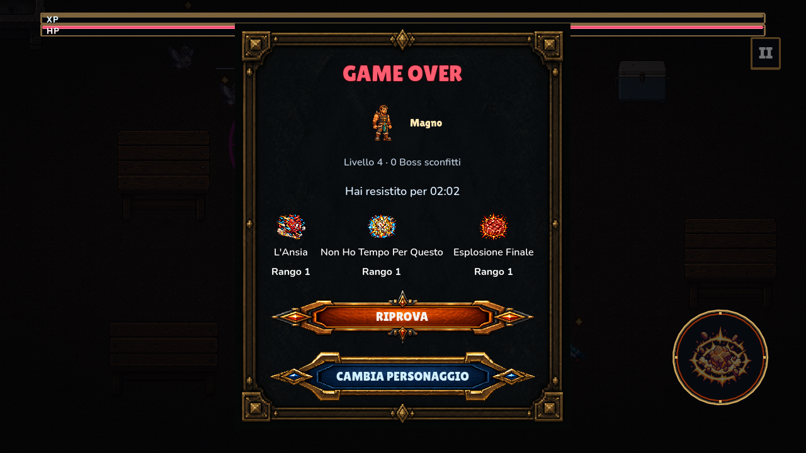

<p align="center">
  
</p>

<h1 align="center">Pidgeon Survivor</h1>
<p align="center"><em>It's grilling time!</em></p>

<p align="center">
  Un bullet heaven 2D in pixel art per Android: scegli uno degli otto
  personaggi, costruisci la tua combinazione di potenziamenti e sopravvivi a
  orde di piccioni e Boss ricorrenti.
</p>

<p align="center">
  <a href="https://github.com/AlessioBarbanti/PidgeonSurvivor/releases/latest"><strong>Scarica l'APK Android</strong></a>
  ·
  <a href="#screenshot">Screenshot</a>
  ·
  <a href="docs/characters.md">Personaggi</a>
</p>

---

## Il gioco

Entra nell'arena, resta in movimento e lascia che il personaggio attacchi
automaticamente il nemico più vicino. Raccogli esperienza, scegli una delle
tre carte proposte a ogni livello e attiva al momento giusto l'abilità unica
del tuo personaggio. Se preferisci avere il pieno controllo dei colpi, nelle
impostazioni puoi passare alla mira manuale.

La run cresce insieme alla tua build: le orde diventano più pressanti, gli
eventi cambiano il ritmo dell'arena e le controparti "Evil" del cast entrano
in scena come Boss con attacchi telegrafati e pattern distintivi.

### Caratteristiche

- Otto personaggi giocabili, ciascuno con ruolo, passiva e abilità attiva.
- Sparo automatico oppure mira manuale opzionale.
- Potenziamenti casuali e ricompense speciali con cui comporre la build.
- Orde, eventi e Boss ricorrenti con attacchi riconoscibili.
- Tutorial integrato e impostazioni persistenti per audio, flash e dimensione
  dei controlli touch.
- Interfaccia pensata per il gioco in orizzontale su smartphone Android.

## Scarica e gioca

La versione corrente del progetto è **v0.2.1**. Scarica
[`pidgeon-survivor.apk`](https://github.com/AlessioBarbanti/PidgeonSurvivor/releases/latest/download/pidgeon-survivor.apk)
e aprilo sul telefono per installarlo. Poiché l'APK è distribuito direttamente
da GitHub e non tramite uno store, Android potrebbe chiederti di autorizzare
l'installazione da questa fonte.

| Requisito | Supporto ufficiale |
|---|---|
| Piattaforma | Android 12–16 |
| Architettura | ARM64 |
| Orientamento | Orizzontale (landscape) |
| Distribuzione | APK tramite GitHub Releases |

> [!IMPORTANT]
> **Pidgeon Survivor è distribuito e supportato ufficialmente solo su telefoni
> Android.** L'avvio su Windows tramite Godot serve esclusivamente allo
> sviluppo e al debug: non è una versione PC ufficiale né una piattaforma
> supportata per gli utenti finali.

## Come si gioca sul telefono

| Azione | Controllo touch |
|---|---|
| Muoversi | Joystick virtuale sinistro |
| Attaccare | Automatico verso il nemico più vicino |
| Mirare manualmente | Secondo joystick, attivabile dalle impostazioni |
| Usare l'abilità | Pulsante abilità sulla destra |
| Mettere in pausa | Pulsante pausa nella parte alta dello schermo |

La modalità automatica ti lascia concentrare su movimento, schivate e tempi
dell'abilità. La modalità manuale aggiunge invece un secondo joystick per
scegliere la direzione di fuoco. Puoi regolare separatamente le dimensioni dei
controlli touch, ridurre i flash e modificare o disattivare l'audio.

## Screenshot

<table>
  <tr>
    <td></td>
    <td></td>
  </tr>
  <tr>
    <td align="center"><sub>Scegli il personaggio e scopri il suo stile di gioco</sub></td>
    <td align="center"><sub>Schiva le orde mentre si avvicina il prossimo Boss</sub></td>
  </tr>
  <tr>
    <td></td>
    <td></td>
  </tr>
  <tr>
    <td align="center"><sub>Leggi i segnali visivi e affronta gli attacchi dei Boss</sub></td>
    <td align="center"><sub>Scegli una carta a ogni livello e costruisci la tua build</sub></td>
  </tr>
  <tr>
    <td colspan="2" align="center"></td>
  </tr>
  <tr>
    <td colspan="2" align="center"><sub>Rivedi il risultato della run e riparti subito o cambia personaggio</sub></td>
  </tr>
</table>

## Il cast

Otto personaggi, otto profili giocabili e otto Boss "Evil" che ne rappresentano
la controparte malvagia. Il [catalogo completo](docs/characters.md) descrive
statistiche, passive e abilità attive.

| Personaggio | Stile di gioco |
|---|---|
| Magno | Mobilità e controllo delle orde |
| Bea | Evasione e riposizionamento |
| Zat | Gestione del danno e sopravvivenza |
| Alea | Rischio, fortuna e mischia |
| Aleo | Sbalzo termico e gestione del danno |
| Lollo | Velocità, caos e imprevedibilità |
| Migi | Difesa e controllo delle orde |
| Marghe | Indebolimento e distrazione dei nemici |

## Stato del progetto e feedback

Il gioco è in sviluppo attivo: contenuti, bilanciamento e presentazione possono
cambiare tra una release e l'altra. Per segnalare un problema o proporre un
miglioramento, apri una
[GitHub Issue](https://github.com/AlessioBarbanti/PidgeonSurvivor/issues)
indicando modello del telefono, versione Android e passaggi per riprodurre il
problema.

## Per sviluppatori

Il progetto usa **Godot 4.7.1 Standard**, GDScript tipizzato e renderer
Compatibility. Su Windows può essere avviato dall'editor esclusivamente come
ambiente di sviluppo e debug:

```powershell
git clone https://github.com/AlessioBarbanti/PidgeonSurvivor.git
# apri la cartella con Godot Engine 4.7.1 Standard e premi Play
```

L'architettura è scene-local e signal-driven, senza autoload o event bus
globale; i dati di bilanciamento sono `Resource` (`.tres`) separati dalla
logica. La suite GUT in [`tests/unit/`](tests/unit/) viene eseguita dal runner
PowerShell [`tools/run-milestone-checks.ps1`](tools/run-milestone-checks.ps1).
Requisiti della toolchain, export e workflow di verifica sono documentati in
[`docs/setup.md`](docs/setup.md) e
[`docs/verification-workflow.md`](docs/verification-workflow.md).

Il lavoro è organizzato nella [board delle card](docs/cards/README.md); i
contratti di prodotto e lo stato corrente dei sistemi sono raccolti
nell'[indice della documentazione](docs/README.md).

## Come viene sviluppato

Il repository è sviluppato con l'assistenza di agenti AI generalisti e
specializzati per attività come implementazione, QA, bilanciamento e produzione
grafica. Configurazioni e procedure sono pubbliche in
[`.claude/`](.claude/) e [`.agents/`](.agents/). Le decisioni di design,
bilanciamento e direzione artistica restano responsabilità del proprietario del
progetto.

## Crediti e licenze

Asset audio e font di terze parti, con relativa licenza e attribuzione, sono
elencati in [`docs/credits.md`](docs/credits.md). Gli asset grafici originali
tracciano provenienza, autore e trasformazioni nei rispettivi
`ASSET-MANIFEST.md` sotto [`assets/`](assets/).
