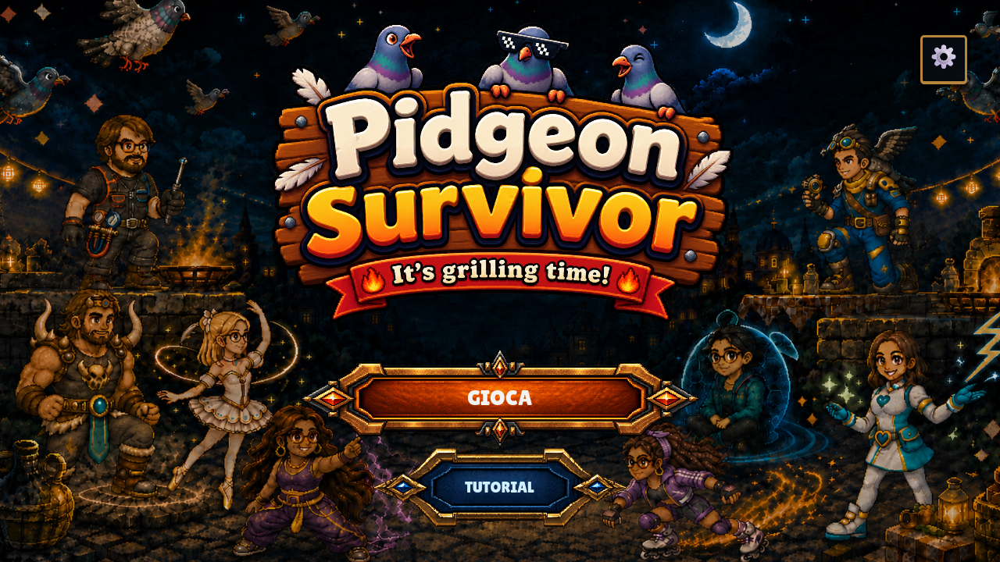
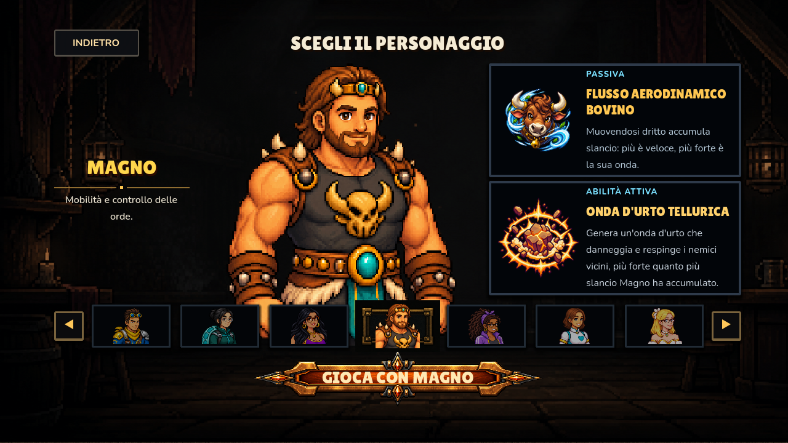
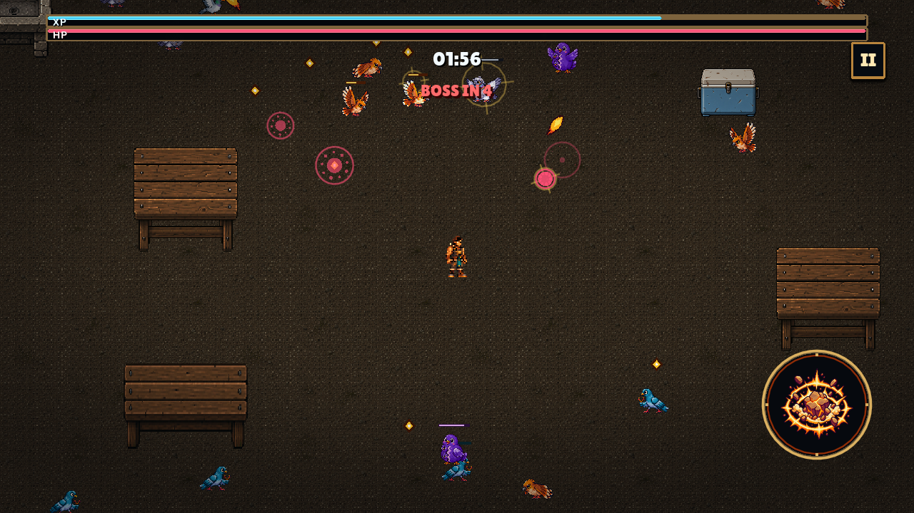
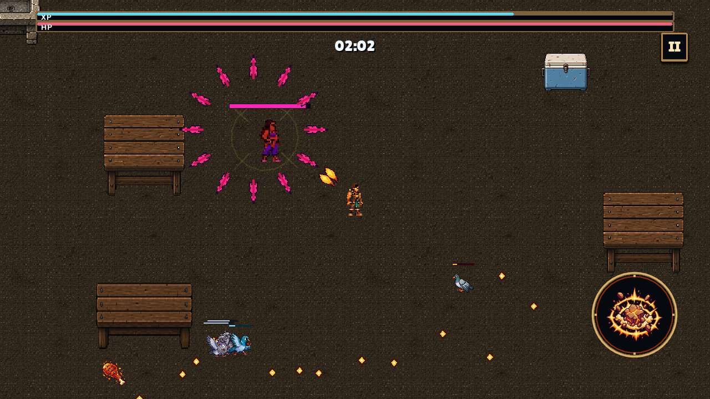
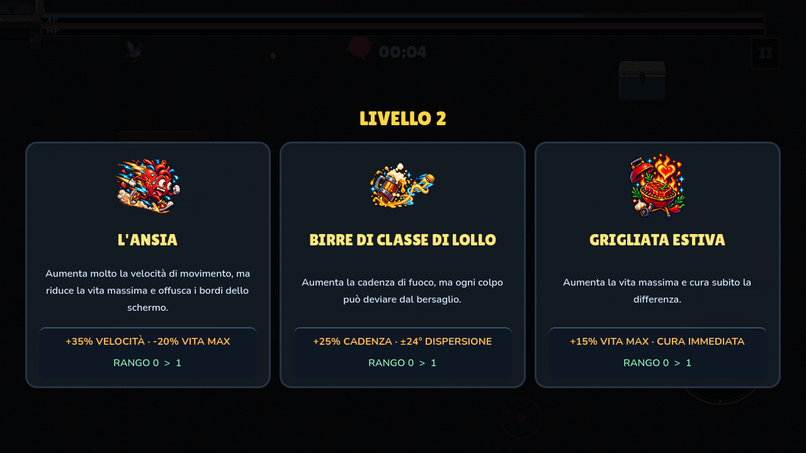

<p align="center">
  
</p>

<h1 align="center">Pidgeon Survivor</h1>
<p align="center"><em>It's grilling time!</em></p>

<p align="center">
  Un bullet heaven 2D minimale in cui otto amici del creatore, caricaturati e
  con le loro citazioni preferite, sopravvivono a orde di piccioni fino allo
  scontro con la propria nemesi malvagia.
</p>

---

## Di cosa si tratta

Ti muovi in un'unica arena, il tuo personaggio spara automaticamente al nemico
più vicino, tu schivi e usi l'abilità attiva quando è pronta. Ogni pochi
secondi arriva un'ondata, ogni po' un boss, e ogni livello ti mette davanti
una scelta di potenziamenti — spesso una battuta interna travestita da carta
di gioco.

L'idea di fondo è **satira personale**: otto persone reali diventano otto
profili giocabili con un ruolo, una passiva e un'abilità che ne esagerano un
tratto caratteriale, e la loro controparte "Evil" diventa il boss che dà la
caccia al giocatore.

## Screenshot

<table>
  <tr>
    <td></td>
    <td></td>
  </tr>
  <tr>
    <td align="center"><sub>Selezione del personaggio, con passiva e abilità attiva in anteprima</sub></td>
    <td align="center"><sub>Arena in pressione, con l'avviso "BOSS IN 4"</sub></td>
  </tr>
  <tr>
    <td></td>
    <td></td>
  </tr>
  <tr>
    <td align="center"><sub>Un boss Evil con il proprio attacco signature telegrafato</sub></td>
    <td align="center"><sub>Scelta dei potenziamenti al level up</sub></td>
  </tr>
</table>

## Il cast

Otto amici, otto profili giocabili, otto boss "Evil" che ne sono la
controparte malvagia. Il catalogo completo, con passive e abilità attive, è
in [`docs/characters.md`](docs/characters.md).

| Personaggio | Ruolo |
|---|---|
| Magno | Mobilità e controllo delle orde |
| Bea | Evasione e riposizionamento |
| Zat | Gestione del danno e sopravvivenza |
| Alea | Rischio, fortuna e mischia |
| Aleo | Sbalzo termico e gestione del danno |
| Lollo | Velocità, caos e imprevedibilità |
| Migi | Difesa e controllo delle orde |
| Marghe | Indebolimento e distrazione dei nemici |

## Come si prova

Il progetto non ha ancora una release pubblica stabile: è un prototipo in
sviluppo continuo. Due modi per provarlo oggi:

**Da editor (Windows/Godot):**

```powershell
git clone https://github.com/AlessioBarbanti/PidgeonSurvivor.git
# apri la cartella con Godot Engine 4.7.1 Standard e premi Play
```

**APK Android di debug:** dalla tab *Actions* del repository, lancia
manualmente il workflow `Android debug APK → GitHub Release`: pubblica un APK
scaricabile nella Release `android-debug-latest`, senza bisogno di toolchain
locale (Godot, JDK, Android SDK/NDK).

## Stack tecnico

- **Motore:** Godot 4.7.1 Standard, GDScript tipizzato, renderer Compatibility.
- **Piattaforme:** Windows x64 e Android 12–16 (API 31–36) ARM64, landscape.
- **Architettura:** scene-local e signal-driven, senza autoload né event bus
  globale; dati di bilanciamento come `Resource` (`.tres`) separati dalla
  logica.
- **Test:** suite GUT deterministica in [`tests/unit/`](tests/unit/), eseguita
  da un unico runner PowerShell ([`tools/run-milestone-checks.ps1`](tools/run-milestone-checks.ps1)).

## Stato del lavoro

Il progetto è organizzato a card, non a roadmap fissa: ogni funzionalità,
fix o asset parte da una card in
[`docs/cards/README.md`](docs/cards/README.md), che resta l'unica fonte di
verità su cosa è fatto, cosa è in corso e cosa è in coda. I contratti di
prodotto e lo stato corrente dei singoli sistemi vivono nei documenti sotto
[`docs/`](docs/README.md) (personaggi, potenziamenti, nemici e boss, UI/UX,
identità visiva e audio).

## Nota sugli agenti

Questo repository è sviluppato con l'assistenza di agenti AI (Claude Code e
Codex), sia generalisti sia specializzati per compito specifico — bilanciamento
numerico, revisione artistica, revisione dei contratti architetturali, QA
esplorativo, generazione di asset grafici. Le loro configurazioni sono
pubbliche nel repository, sotto [`.claude/agents/`](.claude/agents/),
[`.claude/skills/`](.claude/skills/) e [`.agents/skills/`](.agents/skills/).
Ogni decisione di design, bilanciamento e direzione artistica resta comunque
del proprietario del progetto: gli agenti eseguono ed esplorano, non decidono.

## Crediti e licenze

Asset audio e font di terze parti, con relativa licenza e attribuzione, sono
elencati in [`docs/credits.md`](docs/credits.md). Gli asset grafici originali
tracciano provenienza, autore e trasformazioni nei rispettivi
`ASSET-MANIFEST.md` sotto [`assets/`](assets/).
